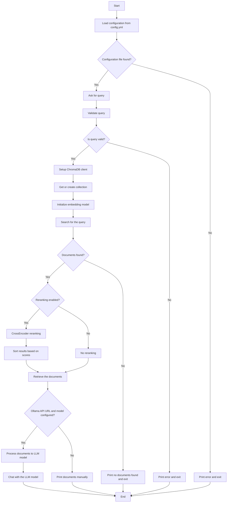

# Retrieve

Retrieve information from the documents using embeddings and send them to the LLM model for further processing.

```mermaid
flowchart TD
    A[Start] --> B[Load configuration from config.yml]
    B --> C{Configuration file found?}
    C -->|No| D[Print error and exit]
    C -->|Yes| E[Ask for query]
    E --> F[Validate query]
    F --> G{Is query valid?}
    G -->|No| H[Print error and exit]
    G -->|Yes| I[Setup ChromaDB client]
    I --> J[Get or create collection]
    J --> K[Initialize embedding model]
    K --> L[Search for the query]
    L --> M{Documents found?}
    M -->|No| N[Print no documents found and exit]
    M -->|Yes| O{Reranking enabled?}
    O -->|Yes| P[CrossEncoder reranking]
    O -->|No| Q[No reranking]
    P --> R[Sort results based on scores]
    R --> S[Retrieve the documents]
    Q --> S
    S --> T{Ollama API URL and model configured?}
    T -->|No| U[Print documents manually]
    T -->|Yes| V[Process documents to LLM model]
    V --> W[Chat with the LLM model]
    W --> X[End]
    U --> X
    N --> X
    H --> X
    D --> X
```