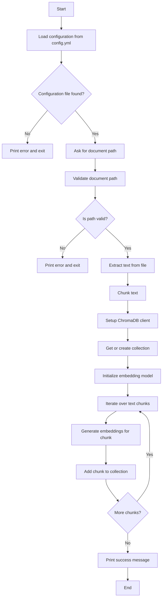

## Store

Extract text from documents and store them in ChromaDB using embeddings.

```mermaid
flowchart TD
    A[Start] --> B[Load configuration from config.yml]
    B --> C{Configuration file found?}
    C -->|No| D[Print error and exit]
    C -->|Yes| E[Ask for document path]
    E --> F[Validate document path]
    F --> G{Is path valid?}
    G -->|No| H[Print error and exit]
    G -->|Yes| I[Extract text from file]
    I --> J[Chunk text]
    J --> K[Setup ChromaDB client]
    K --> L[Get or create collection]
    L --> M[Initialize embedding model]
    M --> N[Iterate over text chunks]
    N --> O[Generate embeddings for chunk]
    O --> P[Add chunk to collection]
    P --> Q{More chunks?}
    Q -->|Yes| N
    Q -->|No| R[Print success message]
    R --> S[End]
```